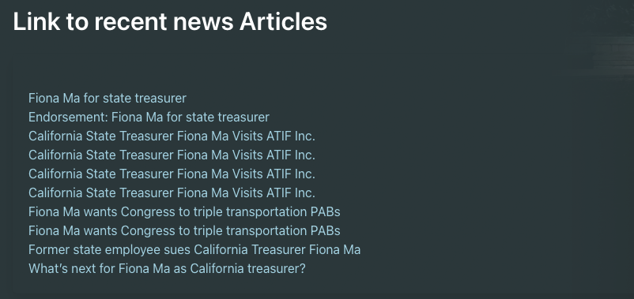

# Know Your Government

Welcome to Know Your Government!  An app that lets you see how your governement is organized, who can support you best, and what your government official has been doing while holding their office.

See what's happening by clicking the link below.

See the [Deployed Site](https://bhaskell7901.github.io/know-your-government/)

## Table of Contents

1. [Technology Used](#technology-used)
2. [Overview and Strategies](#overview-and-strategies)
3. [Landing Page](#landing-page)
4. [Org Chart Page](#org-chart-page)
5. [Bio Page](#bio-page)
6. [Google Civic API and Data](#google-civic-api-and-data)
7. [YouTube API and Data](#youtube-api-and-data)
8. [Perigon API and Data](#perigon-api-and-data)
9. [Data Conversions for APIs and D3.js](#data-conversions-for-apis-and-d3js)
10. [CSS Implementations](#css-implementations)
11. [Learning Points](#learning-points)
12. [Author Info](#author-info)
13. [License](#license)

## Technology Used 

| Technology | Resource URL | 
| ------------- | ------------- | 
| HTML | [https://developer.mozilla.org/en-US/docs/Web/HTML](https://developer.mozilla.org/en-US/docs/Web/HTML) |
| CSS | [https://developer.mozilla.org/en-US/docs/Web/CSS](https://developer.mozilla.org/en-US/docs/Web/CSS) |
| JS | [https://developer.mozilla.org/en-US/docs/Web/JavaScript](https://developer.mozilla.org/en-US/docs/Web/JavaScript) |
| Git | [https://git-scm.com/](https://git-scm.com/) |
| Axios | [https://axios-http.com/](https://axios-http.com/) |
| Bulma | [https://bulma.io/](https://bulma.io/) |
| D3.js | [https://d3js.org/](https://d3js.org/) |

## Overview and Strategies

A general overview of the application flow is:
1. Enter an address to get government info
2. See who your civic officials are & what offices they hold
3. Click on any name to get more information about them

## Landing Page

This is the homepage of the application where the user can enter his/her location to find out who their representatives are. 

Upon entering the address, the input is validated for correctness before API call is triggered. Regex is used to find any characters that is not intended to be the part of the address. Once any unwanted character is found, then we used CSS Bulma Modals to throw error message on screen. 

## Org Chart Page

TODO: More info in this section

## Bio Page

Once a selection is made on the Org Chart page, a function obtains the candidates name and uses it as a query parameter in two seperate API calls. The first is for the Youtube Date V3 API which returns 5 search results with the requried Youtube video ID. We then dyanamical created mutiple `iframe` tags and embeded the video results within. 

The second is for the Perigon API which returns 10 search news results with the requried web link for access access. Again, we used JavaScript to dyanamical create a list of `a` tags and rendered them to the page.  

## Google Civic API and Data

For any U.S. residential address, you can look up who represents that address at each elected level of government using Google Civic information API. It uses a normalized addressing sytem. If address is valid, it gives an object which has information about all the government officials, their levels and roles for that location. If the address is invalid/not found, it throws Bad request/address not found repsonse.

API endpoint - GET https://www.googleapis.com/civicinfo/v2/representatives

This api requires "address" and "api-key" as query parameters. 

Read more about Google Civic API [here](https://developers.google.com/civic-information/docs/v2)

## YouTube API and Data

The YouTube Data API v3 is a web service that allows developers to access and manipulate YouTube videos and other resources. It can be used to retrieve information about videos, channels, playlists, and other resources on YouTube. 

API endpoint - GET https://www.googleapis.com/youtube/v3/search

This api requires a "query" and an "api-key" as parameters. 

Read more about the The YouTube Data API v3 [here](https://developers.google.com/youtube/v3).

# Perigon API and Data

Perigon API is an HTTP REST API for retrieving news and journalist information. It accepts HTTP GET and POST requests, and returns JSON-encoded responses. Standard HTTP response codes are used to indicate a response status for each request.

API endpoint - GET https://api.goperigon.com/v1/all

This requires "representative-name" and "api-key" as query parameters.

Read more about perigon API [here](https://docs.goperigon.com/docs)

## Data Conversions for APIs and D3.js

TODO: More info in this section

## CSS Implementation

TODO: More info in this section

## Bonus Features

TODO: More info in this section

## Usage

To use this application, simple navigate to the [Live Site](https://bhaskell7901.github.io/know-your-government/) and enter your address and click "Look up my reps" button. This will redirect to a new page with a list of their representatives at various levels of government. You can click on any name to see more articles/media about them.

## Learning Points 

TODO: More info in this section

**Project View Snapshot**

TODO: More info in this section

## Author Info

This project was done in collaboration with the following people:

### Srinithi Ravichandran

* [LinkedIn](https://www.linkedin.com/in/srinithi-ravichandran-18891243/)
* [Github](https://github.com/srinithi19)

### Brandon Haskell

* [LinkedIn](https://www.linkedin.com/in/BrandonDHaskell)
* [Github](https://github.com/bhaskell7901)

### Travis DuPree

* [LinkedIn](https://www.linkedin.com/in/travis-dupree-96380218b/)
* [Github](https://github.com/Traveye)

## License

MIT License